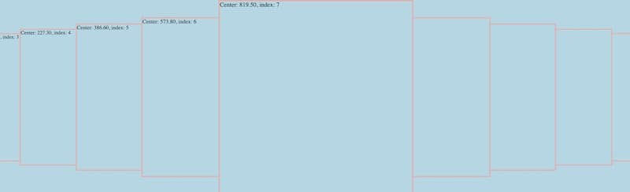

# Carousal 2

A simple carousel implemented in vanilla JavaScript, featuring a stack of cards that smoothly roll in and out of view.

## Calling

```javascript
carouselRolling({ parentId: "c2Wrapper", cardHidePct: 50, cardClass: "class" });
```

## Output:



- When you click a hidden thumbnail, the carousel smoothly rolls the stack, bringing the selected thumbnail into focus.
